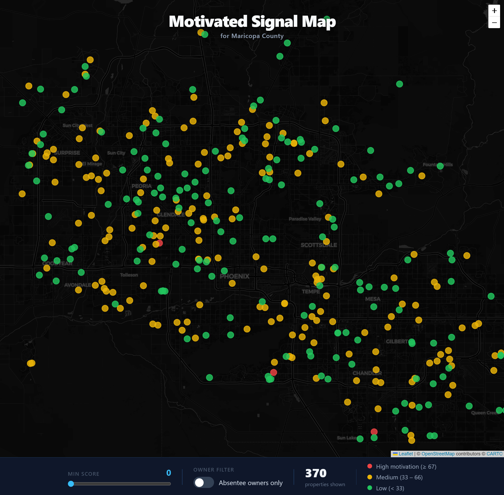
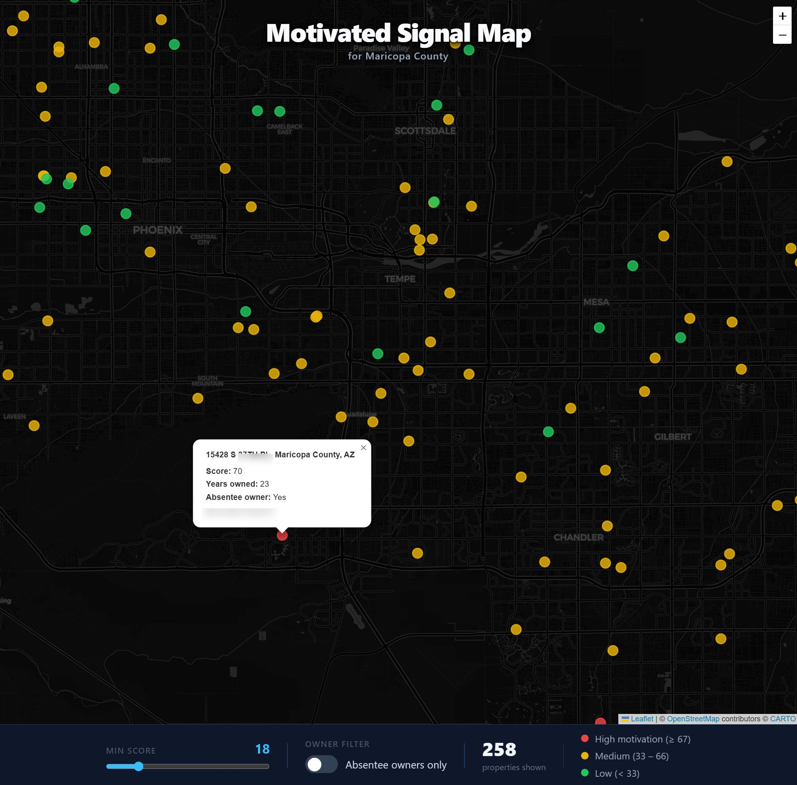

# motivated-signal-map

Visualizes high-motivation real estate sellers in Maricopa County on an interactive map.

## Screenshots





## Features

- 500 properties plotted on a Leaflet map (dark theme)
- Pin colors by motivation score: Red (High ≥67), Yellow (Medium 33–66), Green (Low <33)
- Click a pin to see address, motivation score, years owned, and absentee owner status
- Bottom bar: score filter slider, absentee owner toggle, property count, color legend

## Data

Public bulk data from [Maricopa County Assessor](https://mcassessor.maricopa.gov/page/data_sales/):
- Residential Master (~1.4M records)
- Rental Registration (~270K records)

500 properties sampled after joining on APN (Assessor Parcel Number). Engineered features:
- `years_owned`: Years since deed date
- `absentee_owner`: Rental Indicator = 'Y'

## Stack

| Layer | Tech |
|-------|------|
| Frontend | React 18 + TypeScript + Leaflet |
| Backend | Python + FastAPI |
| Scoring | Rule-based weighted formula (no model training) |
| Geocoding | Census Batch Geocoder (free, no API key) |

## Scoring Formula

```
motivation_score = (years_owned / 40) × 70 + absentee_owner × 30
```

`years_owned` gets 70 points because it's a continuous signal — the longer someone has held a property, the more likely they are to be open to selling. `absentee_owner` gets 30 as a flat bonus: non-resident owners tend to be more transactional, but it's a binary flag with less resolution, so it plays a supporting role.

## Getting Started

### Backend

```bash
cd backend
python -m venv .venv
.venv\Scripts\activate        # Windows
pip install -r requirements.txt
uvicorn main:app --reload
```

### Frontend

```bash
cd frontend
npm install
npm run dev
```

## Project Structure

```
motivated-signal-map/
├── backend/
│   ├── main.py               # FastAPI app & endpoints
│   ├── model.py              # ML scorer
│   ├── geocoder.py           # Census Batch Geocoder
│   └── data/
│       ├── maricopa_sample_500.csv
│       └── geocode_cache.json
├── frontend/
│   └── src/
│       ├── App.tsx
│       ├── components/       # Map, Sidebar
│       └── api/
└── docs/
    └── screenshots/
```

## License

Data sourced from Maricopa County public records. For personal/educational use only.
